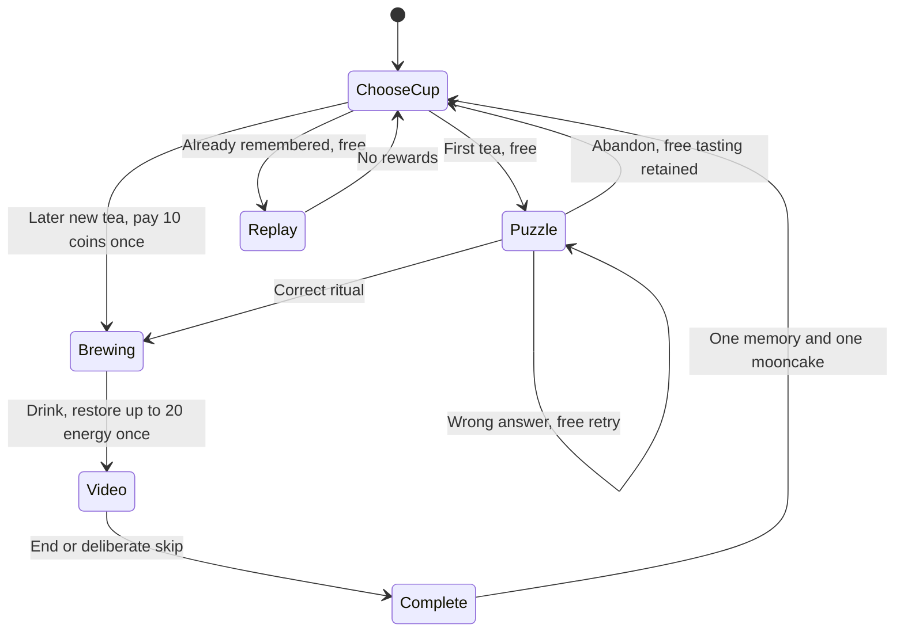

# Teahouse and street lantern minigames

Implementation brief: `/Users/admin/Desktop/jiufen-night-game-plan.md`.
These are local game systems. There is no server, account or network dependency.

## Integration status

The shared checkout now connects the frontend/world adapters to the state and
save modules. No branch merge is needed. The three original eight-second Blender
flashbacks are present under `public/memories/`, and the standalone builder embeds
all three films.

The focused integration review found and resolved three lifecycle issues:

- Oolong's reward and original journal entry now recover in one atomic save.
- Removed video elements have all callbacks detached; leaving the tab pauses and
  checkpoints playback.
- Collecting oolong as the sixth original memory now queues the ending until the
  minigame dialog closes.

These fixes have been checked in source. Final rendered gameplay and mobile QA
remain with the frontend/world task; asset presence is not a playback check.

## Ownership and integration

- `src/minigames.js`: content, rules and synchronous state transitions.
- `src/journey-store.js`: existing story-save migration and atomic browser saves.
- `tests/minigames.test.js`: rule, recovery and navigation tests.
- `src/minigame-ui.js`: frontend adapter, owned by the frontend/world task.

Keep game state in `profile.game`. Load through `readJourney(localStorage)`, not
`normaliseSave` alone, which only knows about the original story fields. New
profiles use `normaliseJourney(profile)` or `normaliseGame()` for their game state.
Keep the character position current before calling `writeJourney(localStorage, profile)`.
The save key remains `evermemory.jiufen.v1`, preserving older journeys.
Completing oolong also restores its original tea journal entry within that same
write, so a reload between reward and frontend callbacks cannot split progress.

Storage access can throw. Keep the call inside a `try` block when accessing
`window.localStorage`; the adapter catches read/write errors once storage is supplied.
`writeJourney` returns `false` if saving fails, so the frontend can tell the player
that only the current session is retained. It never discards the live game state.

## Tasting lifecycle

`beginTasting(game, cupId, teaId)` returns a result string:

| Result | Frontend action |
| --- | --- |
| `no-cup` | Explain that a cup must be collected on the street. |
| `no-coins` | Explain that a new tea costs 10 coins and unsolved lanterns provide coins. |
| `puzzle` | Show the four-step sequence puzzle. |
| `brewing` | Show brewing directly, without a puzzle. |
| `resume` | Resume the existing `game.active.stage`; do not pay again. |
| `replay` | Play the completed memory without invoking reward transitions. |
| `invalid` | Do not proceed or charge. |

Capture `game.active.id` when wiring callbacks. Pass that identity to
`submitRitual(game, sequence, id)`, `abandonPuzzle(game, id)`, `drinkTea(game, id)`,
`checkpointVideo(game, seconds, id)` and `finishTasting(game, id)`. This ensures
late callbacks from an earlier tasting cannot change a later tasting. A repeated
call is otherwise rejected by its stage guard. The optional default identity is
convenient for immediate synchronous actions; media callbacks should pass it explicitly.

Save after each successful transition, after collecting a cup or solving a riddle,
on dialog close and page visibility changes, and periodically while walking or
playing a film. Call `checkpointVideo` with the current playback position before
saving. Restoring a brewing stage may replay the animation but never charges again.
Restoring a video stage never restores tea energy a second time.

## Exploration and resources

Three riddles grant 10 coins each, once. Two cups are reusable across all teas.
Wrong answers and unfinished puzzles carry no penalty. Completed teas offer free
memory replay without resources. Two solved riddles fund all three memories.

Energy starts at 100 and caps at 100. Pass actual position change to `drainEnergy`,
not a held movement key: walking into a wall must not cost energy. Pause drain
during dialogs, puzzles, brewing and flashbacks. The walking multiplier is 0.75
below 25 energy, including at zero. A mooncake is consumed only when owned and
energy is below maximum, restoring up to 40 energy.

`nearestGameObject` separates street objects from indoor objects. Cup collection
removes the cup from interaction results. The frontend must also hide its world
mesh. Solved lanterns remain readable but cannot grant another reward. The
teahouse stays enterable without a cup; only tasting is unavailable.

## Verification

Run `npm test`. The minigame suite covers economy permutations, all cup/tea
choices, retries, stale callbacks, repeat rewards, storage migration/failure,
interrupted playback, energy boundaries and physical interaction reachability.

After frontend integration, verify in the browser: no-cup table, wrong and correct
riddles, cup disappearance, free puzzle retry/abandonment, paid tasting without
puzzle, interrupted video reload/resume, video skip/completion once, free replay,
mooncake consumption, paused depletion and walking at zero energy. Verify all
three flashback assets load and play in both the Vite build and standalone HTML.
