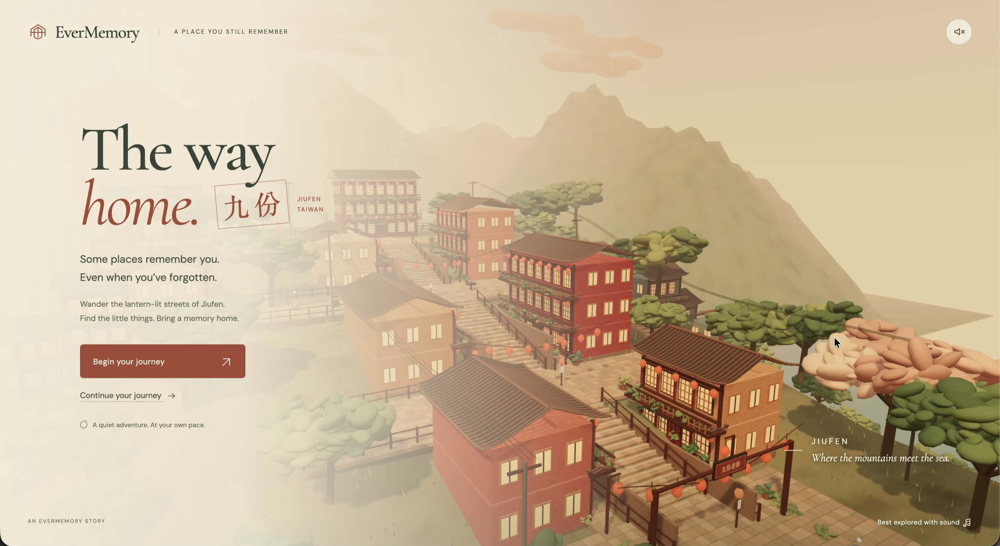
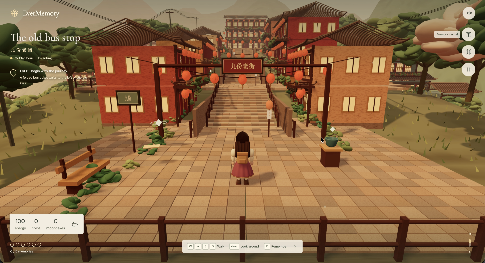
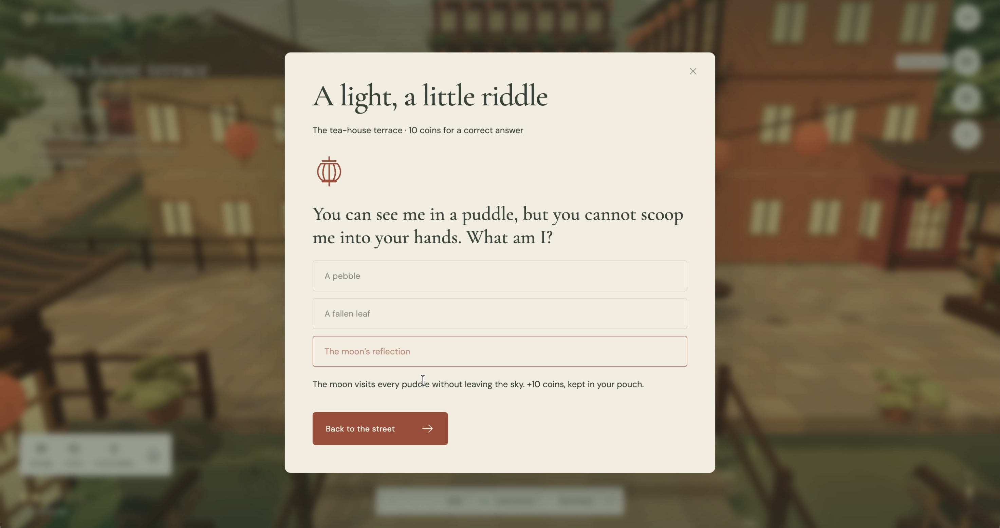
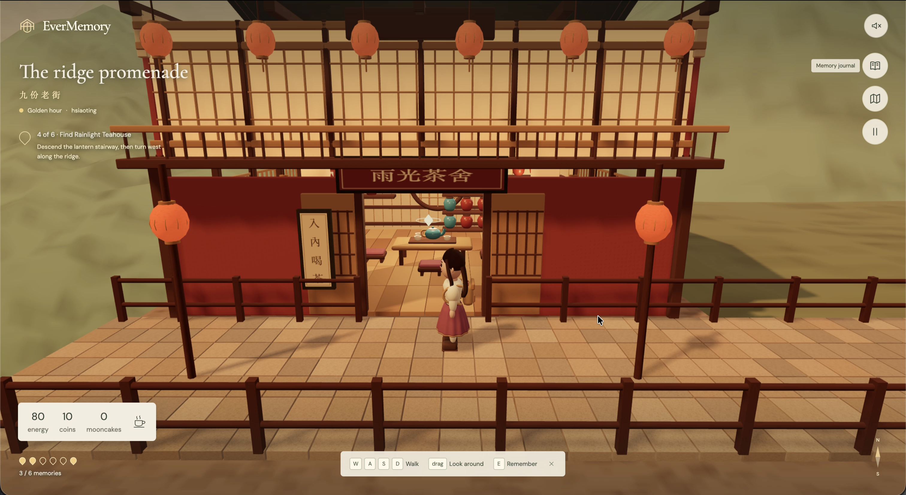
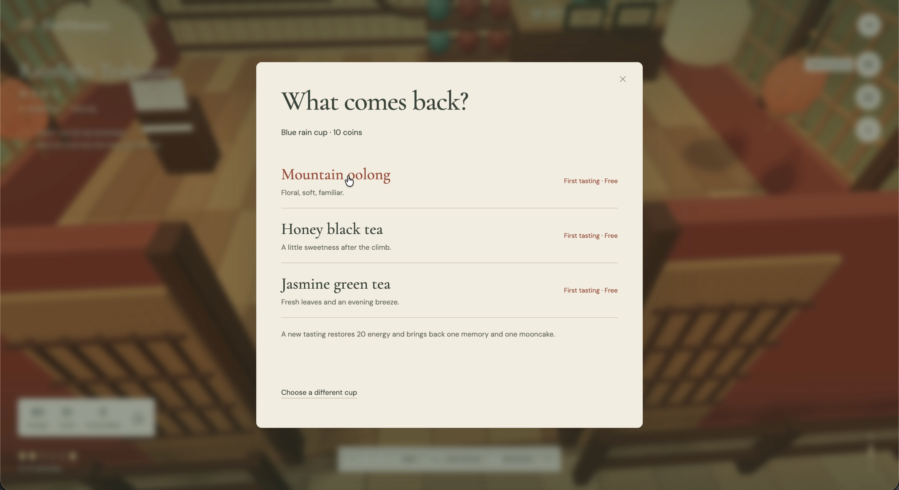
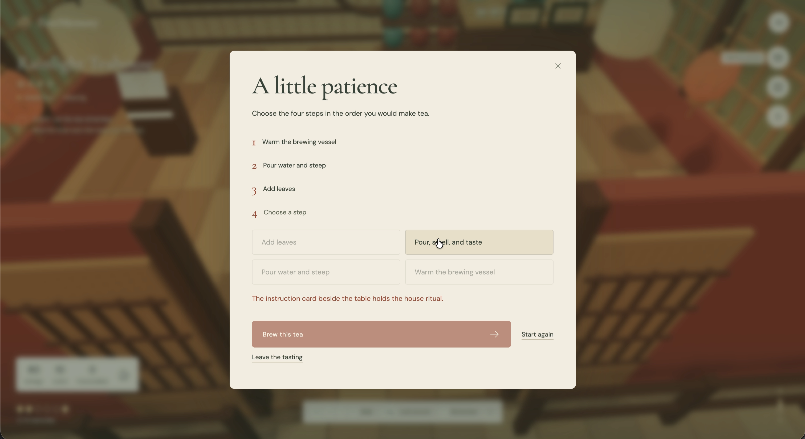
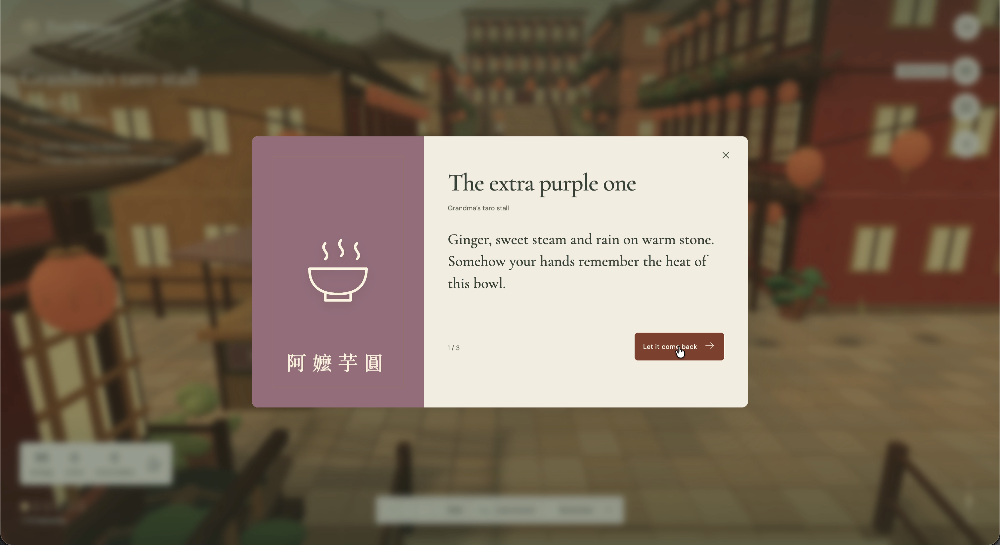
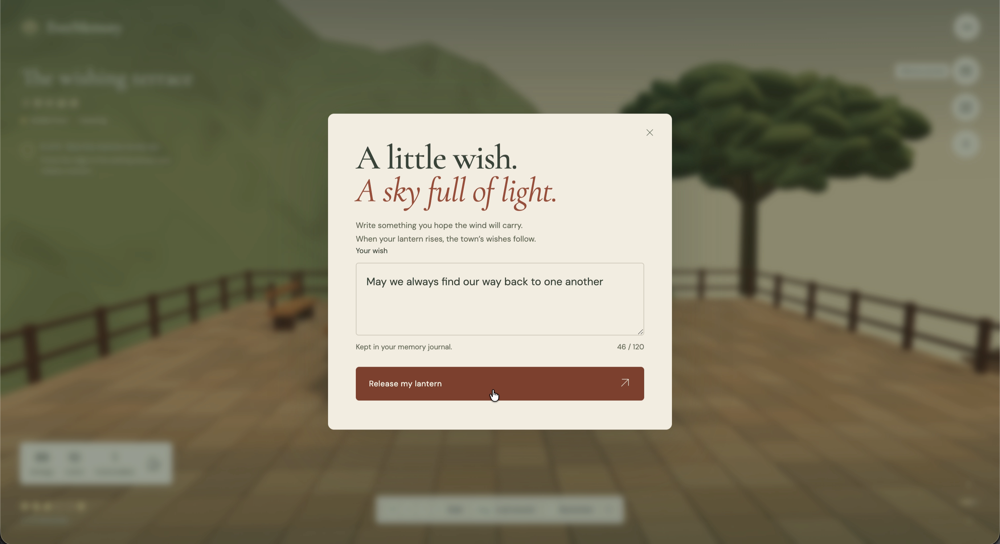
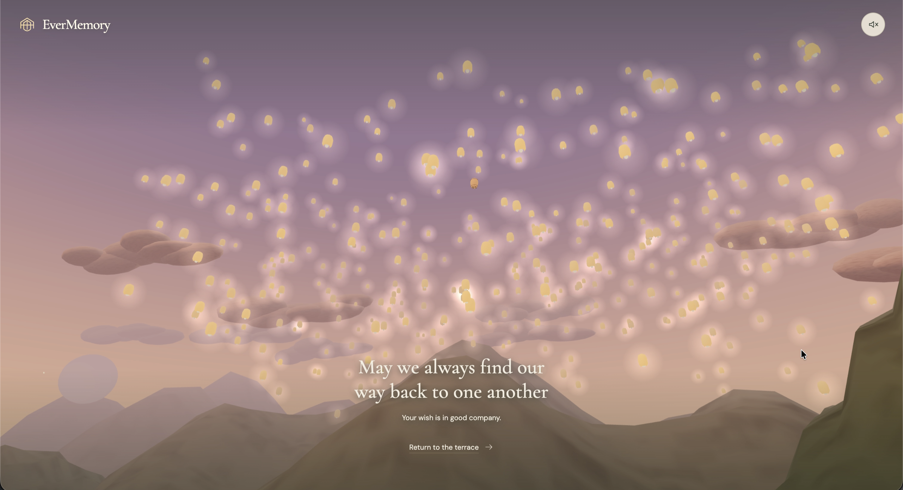

# EverMemory

> What if memory had streets, lanterns, rain, and tea?

A quiet 3D game inspired by childhood family visits to Jiufen, Taiwan. Follow familiar streets and collect the memories they hold.

**[Watch the demo](https://youtu.be/lh7YibZymNA)** · **[Download the game](https://github.com/hsiaotingluv/EverMemory/releases/download/hackathon-demo-2026-09-13/evermemory.html)**

To play, download the HTML file and open it in your browser.

<a name="a-walk-through-the-memory"></a>

## Gameplay walkthrough

### 1. Start or continue your journey

[](https://youtu.be/lh7YibZymNA)

Start a new journey or continue your saved visit to Jiufen.

### 2. Explore Jiufen and collect teacups



Walk from the old bus stop, recover the ticket memory, and find a reusable teacup.

### 3. Solve lantern riddles for coins



Answer a multiple-choice riddle to earn 10 coins for tea.

### 4. Find and enter the hidden teahouse



Bring a collected cup to Rainlight Teahouse to start a tasting.

### 5. Choose a tea to reveal a memory



Choose oolong, black or green tea for a different flashback. Your first tasting is free.

### 6. Play the tea-brewing sequence puzzle



Arrange the four steps for your first tea in the correct order, then watch the brewing animation.

### 7. Discover and collect childhood stories



Read the three-part story at Grandma's taro stall and keep it in your journal.

### 8. Write a wish on your lantern



Write a personal wish to save in your memory journal and send into the sky.

### 9. Release your lantern into the sky



Watch hundreds of lanterns rise with yours, then return to explore.

## At your own pace

- **Rest:** tea and mooncakes restore energy. Low energy slows you down; there is no death.
- **Remember:** keep memories and wishes in your journal, saved in your browser.
- **Set the mood:** choose the time of day, ambient sound and reduced motion.

## Run locally

```sh
npm install
npm run dev
```

Open [localhost:4173](http://127.0.0.1:4173/).

**Move:** WASD / arrows · **Look:** drag · **Interact:** E

Mobile: use the thumb control and on-screen interaction button.

[Full controls, build instructions and project structure →](docs/DEVELOPMENT.md)

## Behind the game

Built with Three.js, Blender and Vite.

[Gameplay](MINIGAMES.md) · [Design](DESIGN.md) · [Asset credits](ASSETS.md) · [Hackathon evidence](SUBMISSION.md)
